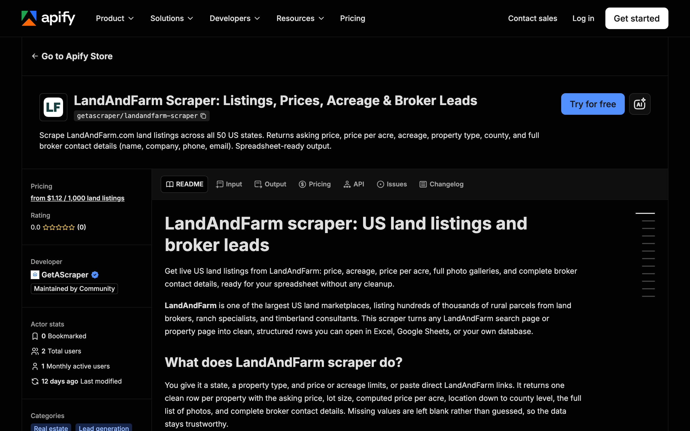

<div align="center">

# LandAndFarm Scraper: US Land Listings and Broker Leads

[](https://apify.com/getascraper/landandfarm-scraper)
[](https://apify.com/getascraper/landandfarm-scraper)
[](https://apify.com/getascraper/landandfarm-scraper)
[](https://github.com/getascraper/how-to-scrape-landandfarm/issues)
[](https://github.com/getascraper/how-to-scrape-landandfarm/commits/main)

Scrape LandAndFarm.com land listings across all 50 US states. Returns asking price, price per acre, acreage, property type, county, and full broker contact details (name, company, phone, email). Spreadsheet-ready output.

[](https://apify.com/getascraper/landandfarm-scraper)

</div>

---

## Why use LandAndFarm Scraper

* **Nationwide coverage**: Pull rural land listings from any of the 50 US states in a single run.
* **Computed price per acre**: Compare land value across states, counties, and land types without doing the math yourself.
* **Full broker contact details**: Get the listing agent name, company, phone number, and email for every property.
* **Clean spreadsheet output**: One flat row per listing, ready to open in Excel, Google Sheets, or your own database.
* **No placeholder data**: Missing values are left blank instead of guessed, so every field you get is genuine.

---

## How to use LandAndFarm Scraper

1. **Choose your search**: Paste direct LandAndFarm search or property links, or leave the link field empty to use the state and property type filters.
2. **Set your filters**: Pick a state, a land category such as farms or ranches, and a price or acreage range.
3. Click **Start**: The actor collects every matching listing and writes one flat row per property.
4. **Download your results**: Export as Excel, CSV, JSON, or HTML from the Output tab.

---

## Input

| Field | Type | Required | Description |
| --- | --- | :---: | --- |
| `startUrls` | array of URLs | No | Direct LandAndFarm search or property links. Leave empty to use the state and type filters below. |
| `stateFilter` | string | No | Two letter US state code to search, such as TX, FL, or SC. Leave empty for no state filter. |
| `propertyType` | string | No | Restrict results to one land category, such as farms, ranches, hunting land, or timberland. Leave empty for all types. |
| `minPrice` | integer | No | Minimum asking price in US dollars. Use 0 for no minimum. |
| `maxPrice` | integer | No | Maximum asking price in US dollars. Use 0 for no maximum. |
| `minAcres` | number | No | Minimum lot size in acres. Use 0 for no minimum. |
| `maxAcres` | number | No | Maximum lot size in acres. Use 0 for no maximum. |
| `maxItems` | integer | No | Maximum number of listings to save in one run. Defaults to 100. |
| `proxyConfiguration` | object | No | Proxy settings. US residential routing is required for reliable results and is set as the default. |

---

## Output

Each row in your dataset is one land listing. All fields are flat with no nested data, so the file opens cleanly in any spreadsheet program.

```json
{
  "title": "92.53 Acres in Laurens, SC - $1,860,000",
  "price": 1860000,
  "priceText": "$1,860,000",
  "pricePerAcre": 20101.59,
  "acres": 92.53,
  "city": "Laurens",
  "state": "South Carolina",
  "stateAbbreviation": "SC",
  "county": "Laurens County",
  "zip": "29360",
  "streetAddress": "672 Boxwood Road",
  "latitude": 34.49,
  "longitude": -82.01,
  "propertyType": "Farms",
  "propertyTypesAll": "Farms, Residential Land, Hunting Land",
  "beds": 3,
  "baths": 3.5,
  "homeSqft": 3000,
  "hasHouse": true,
  "description": "92.53 acre farm with custom home, pasture, and pond.",
  "imageCount": 46,
  "primaryImageUrl": "https://assets.landandfarm.com/resizedimages/800/0/h/80/1-5445374106",
  "images": [
    "https://assets.landandfarm.com/resizedimages/800/0/h/80/1-5445374106",
    "https://assets.landandfarm.com/resizedimages/800/0/h/80/1-5445374177"
  ],
  "listingDate": "2025-03-14",
  "brokerName": "Rusty Hamrick",
  "brokerCompany": "Huff Creek Properties",
  "brokerPhone": "(864) 230-0694",
  "brokerEmail": "rusty@huffcreekproperties.com",
  "brokerWebsite": "www.huffcreekproperties.com",
  "propertyUrl": "https://www.landandfarm.com/property/ervindale-farm-36928340/",
  "scrapedAt": "2026-06-28T12:51:53.941Z"
}
```

### Data table

| Field | Type | Description |
| --- | :---: | --- |
| `title` | string | Listing headline. |
| `price` | number | Asking price in US dollars. |
| `priceText` | string | Asking price as a display string. |
| `pricePerAcre` | number | Price divided by acreage, computed for you. |
| `acres` | number | Lot size in acres. |
| `city` | string | City or nearest town. |
| `state` | string | Full state name. |
| `stateAbbreviation` | string | Two letter state code. |
| `county` | string | County name. |
| `zip` | string | ZIP code. |
| `streetAddress` | string | Street address, when listed. |
| `latitude` | number | Map latitude. |
| `longitude` | number | Map longitude. |
| `propertyType` | string | Primary land category. |
| `propertyTypesAll` | string | All land categories, comma separated. |
| `beds` | number | Bedroom count, for parcels with a home. |
| `baths` | number | Bathroom count, half baths counted as 0.5. |
| `homeSqft` | number | Home interior square footage, blank for vacant land. |
| `hasHouse` | boolean | True when the parcel includes a home. |
| `description` | string | Full listing description. |
| `imageCount` | number | Total number of photos. |
| `primaryImageUrl` | string | Main cover photo. |
| `images` | array of strings | Every photo in the listing gallery. |
| `listingDate` | string | Date the listing first appeared. |
| `brokerName` | string | Listing agent name. |
| `brokerCompany` | string | Listing brokerage name. |
| `brokerPhone` | string | Listing agent phone number. |
| `brokerEmail` | string | Listing agent email, when public. |
| `brokerWebsite` | string | Listing agent website. |
| `propertyUrl` | string | Direct link to the listing. |
| `scrapedAt` | string | Timestamp of when the row was collected. |

---

## Pricing

**$1.49 per 1,000 results.** No monthly subscriptions and no minimum commits. New Apify accounts include $5 of free usage, so you can try it before you pay.

You only pay for the listings you collect. A typical run of 100 listings completes in a few minutes.

---

## Quick start

Create a `.env` file from `.env.example`, add your [Apify API token](https://console.apify.com/account/integrations), and run:

```bash
npm install
npm start
```

The script uses the [Apify API client](https://docs.apify.com/api/client/js/) to start the actor and fetch results.

---

## Tips and optimization

* **Combine state and type filters** to narrow a run to exactly the land category and region you need.
* **Use price and acreage limits** to skip listings outside your budget or size range before you pay for results.
* **Paste direct property links** in `startUrls` when you already know which listings you want.
* **Set `maxItems`** to keep every run within a predictable cost.

---

## FAQ

**Does this include broker contact details?**
Yes. Every row includes the listing agent name, brokerage company, phone number, email when public, and website.

**Can I search by county or city instead of state?**
Yes. Paste a direct LandAndFarm search link for that county or city into `startUrls`.

**Why is a field sometimes blank?**
Listings vary in how much detail sellers provide. When a value is genuinely missing on the source page, the field is left blank rather than filled with a placeholder.

**Does it work for every US state?**
Yes. All 50 states are supported through the state filter or direct search links.

---

## Support

For bug reports, missing fields, or feature requests, open an issue under the [Issues](https://github.com/getascraper/how-to-scrape-landandfarm/issues) tab.
